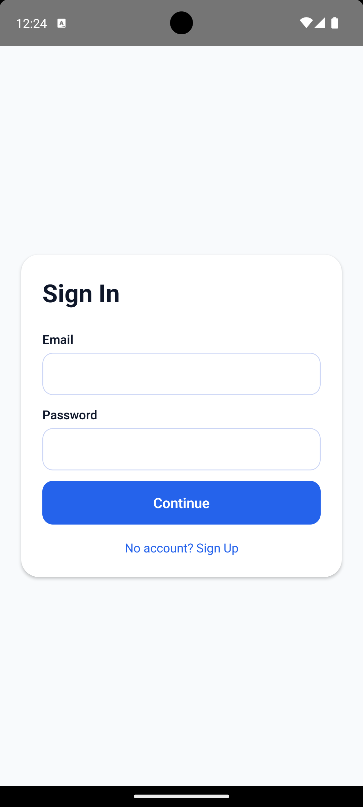

## CityPulse – Local Events Explorer

CityPulse is a React Native application that helps residents browse events in their city, mark their favourites, and manage their profile with language + biometric preferences. The stack uses TypeScript, Atomic Design, Redux Toolkit with persist, Firebase Auth/Firestore, i18next, and React Navigation (stack + tabs + modal).

### Key features
- Firebase email/password sign-up & sign-in, plus Firestore user profile storage
- Dashboard with Firestore-backed queries, grouped per city and searchable by city or event title
- Event detail modal with map preview and favourite toggle stored strictly in Redux Persist
- Profile screen with language toggle (English ↔ Arabic) that flips RTL/LTR, logout, and biometric helper
- Bonus: Biometric helper built on `react-native-biometrics`

---

## Folder structure

```
src/
  atoms/               # Reusable primitives (Button, Input, Card, Text)
  molecules/           # Composed widgets (SearchBar, EventCard, ProfileInfo)
  organisms/           # Domain-specific assemblies (CityEventList, ProfileSettings)
  navigation/          # Root stack + tabs + type definitions
  screens/             # Auth, Dashboard, EventDetails, Profile, Splash
  redux/
    slices/            # auth, favorites, language, events
    store.ts           # Redux Toolkit + redux-persist setup
  hooks/               # useAuth, useEvents, useFavorites, useLanguage, useBiometrics
  services/
    firebase/          # Auth + Firestore helpers & config
    api/               # Firestore event queries
  utils/               # formatters, grouping helpers, RTL utilities
  i18n/                # i18next bootstrap + translations (en/ar)
  assets/              # Static translations + placeholder images
screenshots/           # Drop UI captures here (empty placeholder committed)
```

This mirrors Atomic Design (atoms → molecules → organisms → screens) and keeps business logic in hooks/services.

---

## Requirements & assumptions

- Node.js ≥ 20 is recommended (React Native 0.82 requires it). Tooling may warn if you run on Node 18.
- `events` and `users` collections already exist in Firestore with the schema described below.
- Firestore composite indexes are set up for city equality and title range queries.
- `google-services.json` (Android) and `GoogleService-Info.plist` (iOS) are provided by your Firebase project.
- Device simulators have Maps SDK configured (iOS requires CocoaPods linking).

---

## Setup steps

1. **Install dependencies**
   ```bash
   npm install
   ```
2. **iOS pods**
   ```bash
   cd ios && pod install && cd ..
   ```
3. **Firebase config**
   - Android: place `android/app/google-services.json`.
   - iOS: place `ios/CityPulse/GoogleService-Info.plist` (placeholder already exists—replace with your file).
   - Enable Email/Password auth in Firebase Console.
   - Create Firestore collections:  
     ```
     /users/{uid} -> { uid, name, email, phone }
     /events/{id} -> { title, city, date, venue, lat, lng, description, category }
     ```
   - Optional sample `events` document:
     ```json
     {
       "title": "Tech Meetup",
       "city": "Chennai",
       "date": "2025-02-20T18:30:00.000Z",
       "venue": "SP Infocity",
       "lat": 13.0827,
       "lng": 80.2707,
       "description": "Monthly community meetup",
       "category": "Technology"
     }
     ```
4. **Firestore indexes**  
   - Single-field: `city` (ascending)  
   - Composite: `{ field: title (asc) }` for prefix search (needed for `startAt`/`endAt` queries).

---

## Running the app

```bash
npm start          # start Metro
npm run android    # build & install on Android emulator/device
npm run ios        # build & install on iOS simulator/device

npm run lint       # ESLint + Prettier checks
npm run typecheck  # Strict TypeScript (noEmit)
npm test           # Jest + React Native Testing Library
```

Node 20+ is required by the official RN toolchain—upgrade if Metro warns about engines.

---

## Feature highlights
- **Navigation:** Root stack (`Splash`, `AuthStack`, `MainTabs`, `EventDetails` modal) plus bottom tabs (Dashboard/Profile).
- **State:** Redux Toolkit slices with redux-persist (AsyncStorage) for `auth`, `favorites`, `language`. `events` slice stays volatile.
- **i18n & RTL:** i18next + react-i18next + react-native-localize with English & Arabic translations. Switching to Arabic automatically flips RTL via `I18nManager`.
- **Hooks:** `useAuth`, `useEvents`, `useFavorites`, `useLanguage`, `useBiometrics` isolate business logic from UI.
- **Firebase:** Authentication + Firestore queries (city/name search) with helper services.
- **Maps:** `react-native-maps` preview centered on event coordinates with a single marker.
- **Biometrics:** Helper built on `react-native-biometrics` (bonus requirement).
- **Tests:** Sample component test for `EventCard` using `@testing-library/react-native`.

---

## Screenshots

<p align="center">
  
  
  
  
</p>

<p align="center">
  
  
  
  
</p>

<p align="center">
  
  
  
  
</p>

<p align="center">
  
  
</p>

---

## Demo

You can watch a short walkthrough of CityPulse here. The embedded player works on GitHub; if it doesn’t autoplay, click the title to open it in Google Drive.

<p align="center">
  <a href="https://drive.google.com/file/d/1vzJVpRQL35eFrBFKv1E8etoNb1iKqT2v/view?usp=sharing" target="_blank">
    
  </a>
</p>

<p align="center">
  <iframe
    src="https://drive.google.com/file/d/1WthNci_rulbSrCC6_vicBe9Eo-OywFQ5/preview"
    width="640"
    height="360"
    allow="autoplay"
    style="max-width: 100%; border: none;"
  ></iframe>
</p>

---

## Bonus features implemented
- Biometric helper (`useBiometrics`) with UI affordance on the Sign In + Profile screens.
- Strict TypeScript configuration (`strict`, `noUncheckedIndexedAccess`, `noImplicitOverride`).
- ESLint + Prettier integration with project scripts.

---

## Notes & troubleshooting

- `@react-native-firebase/*` requires native builds. After installing dependencies, always run `pod install` for iOS.
- `react-native-maps` needs Google Maps SDK keys if you want production traffic; the default Apple/Google keys suffice for simulator testing.
- When switching to Arabic, the layout direction flips. Reload the app if you notice stale layouts after toggling language.
- Favourite events are intentionally stored **only** in Redux Persist (no Firestore sync) to honor the requirement.
- Metro bundler or gradle may warn about Node 18. Upgrade Node to 20+ for best compatibility.

Happy hacking! 🎉
